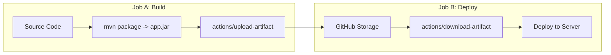

# Module 10: Advanced Continuous Integration Strategies

## Core Curriculum
- Matrix Build Strategies: Dynamic scaling of test environments
- Optimizing Pipelines: Caching dependencies and build packages
- Artifact Management: Storing binaries (`upload-artifact` / `download-artifact`)
- Job Outputs: Passing variables and states across dependent jobs
- Curating Marketplace Actions

---

## 1. Matrix Strategies
Running tests on a single OS or runtime can lead to hidden compatibility bugs. For example, your Java code might compile fine under Java 17 on Linux, but fail under Java 11 on Windows due to platform-specific path structures.

A **Matrix Strategy** lets you automatically run a job multiple times with different combinations of parameters (e.g., operating systems, language versions).

```yaml
jobs:
  test-suite:
    runs-on: ${{ matrix.os }}
    strategy:
      # If one combination fails, keep running the others to see all diagnostics
      fail-fast: false
      matrix:
        os: [ubuntu-latest, windows-latest, macos-latest]
        java-version: [11, 17, 21]
```
*This definition automatically generates and runs **9 individual parallel jobs** (3 Operating Systems × 3 Java versions).*

---

## 2. Speed Optimization: Dependency Caching
A significant bottleneck in standard CI runs is download latency. Every time a Maven pipeline runs, it pulls massive numbers of external dependencies from Maven Central, slowing down the build and consuming bandwidth.

By caching the `~/.m2/repository` directory between runs, Maven can reuse cached dependency jars unless the `pom.xml` changes.

Using `actions/setup-java@v3`, enabling Maven caching is incredibly simple:
```yaml
- name: Set up JDK & Cache Maven
  uses: actions/setup-java@v3
  with:
    java-version: '17'
    distribution: 'temurin'
    cache: 'maven' # Automatically caches ~/.m2/repository based on hash of pom.xml
```

---

## 3. Passing Artifacts Between Jobs
Because each job executes on a completely clean, isolated Runner VM, files created in Job A (like compiled `.class` files or packaged `.jar` files) do not exist in Job B.

To share files across jobs:
1. **Upload** the files as an Artifact in Job A.
2. **Download** the Artifact in Job B.



### Uploading Artifact (Job 1):
```yaml
- name: Archive Production JAR
  uses: actions/upload-artifact@v3
  with:
    name: packaged-app
    path: target/my-app-1.0.jar
    retention-days: 5
```

### Downloading Artifact (Job 2):
```yaml
- name: Retrieve Production JAR
  uses: actions/download-artifact@v3
  with:
    name: packaged-app
    path: deploy-folder/
```

---

## 4. Passing Variables (Job Outputs)
Sometimes, you don't need to pass massive files, but rather a simple variable or state (like a dynamically generated version string or container image tag) from one job to another.

### Declaring Outputs in Job A:
```yaml
jobs:
  generator:
    runs-on: ubuntu-latest
    outputs:
      build_tag: ${{ steps.set-tag.outputs.tag }}
    steps:
      - id: set-tag
        run: echo "tag=prod-v$(date +'%Y%m%d%H%M')" >> "$GITHUB_OUTPUT"
```

### Consuming Outputs in Job B:
```yaml
  deploy:
    runs-on: ubuntu-latest
    needs: generator
    steps:
      - name: Deploy Image Tag
        run: echo "Deploying tag: ${{ needs.generator.outputs.build_tag }}"
```

---

## Summary
Advanced GitHub Actions utilizes build matrices to achieve broad platform coverage, optimizes performance via maven dependency caching, and bridges isolated runner contexts by passing structural variables (outputs) and packages (artifacts) across the build stages.
