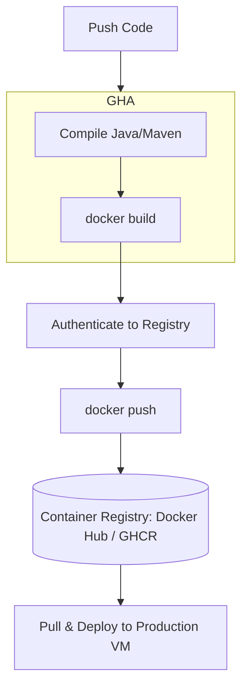

# Module 11: Containerized CI/CD with Docker & GitHub Actions

## Core Curriculum
- The Containerized CI/CD workflow
- GitHub Secrets: Storing passwords, API keys, and registry tokens securely
- Building Docker Images in CI Runners
- Tagging Strategies: `latest` vs Commit SHA vs SemVer tags
- Pushing to Public & Private Registries: Docker Hub & GitHub Container Registry (GHCR)

---

## 1. Containerized CI/CD Workflow
In modern cloud-native software pipelines, shipping raw compiled packages (like JARs or zip files) directly to servers is an anti-pattern. Instead, we bundle our application along with its complete, isolated OS environment into a **Docker Image** during the CI pipeline, and push that image to a **Container Registry**. 

The target server then simply pulls the image and runs it, ensuring the exact same code runs in staging and production.



---

## 2. Managing Credentials with GitHub Secrets
To push images to a container registry, the GitHub Actions Runner must authenticate. Hardcoding credentials (usernames and passwords) in a public or private YAML workflow is an extreme security vulnerability.

GitHub provides **Secrets** to store sensitive variables securely:
- Secrets are encrypted at rest.
- They are injected as environment variables into runners at runtime.
- They are automatically masked (shown as `***`) in execution logs to prevent accidental exposure.
- **Accessing Secrets in YAML:** `${{ secrets.DOCKER_HUB_TOKEN }}`

---

## 3. GitHub Container Registry (GHCR) vs Docker Hub
DevOps pipelines often push to multiple registries for redundancy or scoping reasons:

| Feature | Docker Hub | GitHub Container Registry (GHCR) |
|---|---|---|
| **Domain** | `docker.io` | `ghcr.io` |
| **Authentication** | Docker Hub Password or Personal Access Token (PAT) | GitHub PAT (`GITHUB_TOKEN` is automatically provided!) |
| **Scoping** | Docker Hub Username / Organization | Tied to your GitHub Organization or User Account |
| **Integration** | External integration required | Native. Packages tab appears directly on your GitHub Profile. |

---

## 4. Multi-Registry Push Configuration
Here is a complete, production-grade GitHub Actions workflow that compiles a project, builds its Docker image, signs in to both Docker Hub and GHCR simultaneously, and pushes the tagged image:

```yaml
name: Package & Publish Container Image

on:
  push:
    branches: [ main ]
    tags: [ 'v*.*.*' ] # Triggers on releases like v1.0.0

jobs:
  publish-image:
    runs-on: ubuntu-latest
    
    steps:
      - name: Checkout Source Code
        uses: actions/checkout@v4

      # Step 1: Set up Docker Buildx (Enables advanced caching features)
      - name: Set up Docker Buildx
        uses: docker/setup-buildx-action@v3

      # Step 2: Log in to Docker Hub (Using repository secrets)
      - name: Login to Docker Hub
        uses: docker/login-action@v3
        with:
          username: ${{ secrets.DOCKER_HUB_USERNAME }}
          password: ${{ secrets.DOCKER_HUB_PASSWORD }}

      # Step 3: Log in to GHCR (Using the automatically generated GITHUB_TOKEN)
      - name: Login to GitHub Container Registry (GHCR)
        uses: docker/login-action@v3
        with:
          registry: ghcr.io
          username: ${{ github.actor }}
          password: ${{ secrets.GITHUB_TOKEN }}

      # Step 4: Extract Metadata (Generates dynamic tags like latest, SHA, and version numbers)
      - name: Extract Docker Metadata
        id: meta
        uses: docker/metadata-action@v5
        with:
          images: |
            sriragavandhandapani/int332-app
            ghcr.io/${{ github.repository }}
          tags: |
            type=raw,value=latest
            type=sha,format=short
            type=semver,pattern={{version}}

      # Step 5: Build and Push the Image to both registries
      - name: Build and Push Docker Image
        uses: docker/build-push-action@v5
        with:
          context: .
          file: ./Dockerfile
          push: true
          tags: ${{ steps.meta.outputs.tags }}
          labels: ${{ steps.meta.outputs.labels }}
          cache-from: type=gha
          cache-to: type=gha,mode=max
```

---

## 5. Tagging Best Practices
Never rely strictly on the `latest` tag in production environments. If a buggy build is pushed to `latest`, your servers will pull it and crash.

**Production Tagging Strategy:**
1. **`latest`:** Used for quick local runs and diagnostic checks.
2. **Commit SHA (`sha-xxxxxxx`):** A unique, immutable tag representing the exact git commit that generated the container. If production experiences issues, you can instantly roll back to a specific commit tag.
3. **Semantic Versioning (`v1.2.3`):** Declared when releasing formal production releases, representing major/minor/patch upgrades.
