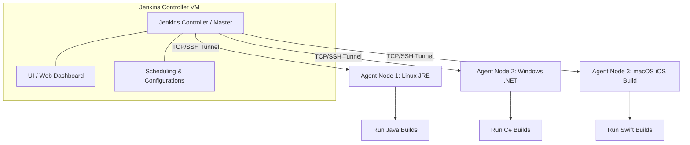

# Module 12: Continuous Integration with Jenkins

## Core Curriculum
- Jenkins Architecture: Controller (Master) & Agent (Slave) Topology
- Running Jenkins inside a Docker Container with Volumes
- Freestyle vs. Pipeline Jobs
- Declarative Pipeline Syntax: `pipeline`, `agent`, `stages`, `stage`, `steps`, `post`
- Structuring a standalone `Jenkinsfile`

---

## 1. Jenkins Architecture & Topology
Jenkins is a self-contained, open-source automation server used to orchestrate CI/CD pipelines. Unlike GitHub Actions which provides managed cloud VM runners, Jenkins is typically self-hosted.



### Core Architecture Components:
1. **Controller (Master):** The brain of Jenkins. It hosts the web dashboard, manages user configurations, schedules builds, orchestrates security policies, and monitors agents. The controller **should not** run actual resource-heavy builds.
2. **Agents (Slaves / Nodes):** Light executors that run JRE/JDK instances. They connect to the controller via SSH or JNLP tunnels and execute the actual steps of a build job. 
3. **Plugins:** The lifeblood of Jenkins. Since Jenkins is core-minimal, plugins add functionality like Git integration, Maven builds, Docker APIs, and Slack alerts.

---

## 2. Dockerized Jenkins Installation
Running Jenkins in a Docker container simplifies maintenance and guarantees environment reproducibility. Because Jenkins needs to persist its build configs, plugin data, and job histories, we must mount a Docker Volume.

```bash
docker run -d \
  --name jenkins-master \
  -p 8080:8080 \
  -p 50000:50000 \
  -v jenkins_home:/var/jenkins_home \
  --restart=on-failure \
  jenkins/jenkins:lts-jdk17
```
- `-p 8080:8080`: Exposes the web interface dashboard.
- `-p 50000:50000`: Port used by inbound agents to tunnel connections to the controller.
- `-v jenkins_home:/var/jenkins_home`: Persists all configs and logs to a host-managed volume.

---

## 3. Freestyle vs. Pipeline Jobs
As Jenkins evolved, the approach to declaring jobs shifted from GUI-focused configurations to "Configuration as Code".

| Feature | Freestyle Jobs | Pipeline Jobs (Modern Standard) |
|---|---|---|
| **Configuration** | Configured exclusively using Jenkins Web UI forms. | Declared programmatically in a code file (`Jenkinsfile`). |
| **Version Control** | Hard to track changes; configurations are hidden in raw XML on the controller. | Stored in Git, enabling pull requests, history audits, and branch comparisons. |
| **Complexity** | Becomes messy when orchestrating parallel execution or sequential logic. | Extremely flexible. Handles complex branching, approvals, and error catches cleanly. |

---

## 4. Declarative Pipeline Syntax
Declarative pipelines are the modern standard for Jenkins, providing a highly structured, readable, and clean schema.

Here is the standard structure of a `Jenkinsfile`:

```groovy
pipeline {
    // Defines where this pipeline executes ('any' runner, a specific node, or Docker container)
    agent any

    // Environment-wide variables
    environment {
        APP_NAME = 'devops-demo'
        PORT = '8080'
    }

    // List of stages to execute sequentially
    stages {
        stage('Checkout Source') {
            steps {
                echo 'Pulling latest code changes from GitHub...'
                checkout scm
            }
        }
        
        stage('Compile & Test') {
            steps {
                echo 'Running Maven build...'
                sh 'mvn -B clean test'
            }
        }

        stage('Package Application') {
            steps {
                echo 'Packaging application artifact...'
                sh 'mvn package -DskipTests'
            }
        }
    }

    // Lifecycle hooks executed after stages finish
    post {
        always {
            echo 'Archiving log files...'
        }
        success {
            echo 'Build Succeeded! Triggering alerts...'
        }
        failure {
            echo 'Build Failed! Interrogating log dumps...'
        }
    }
}
```

---

## Summary
Jenkins provides complete ownership over CI/CD pipelines via its robust Controller-Agent self-hosted topology. Transitioning from legacy Freestyle configurations to modern Declarative pipelines allows engineers to store their entire build logic inside a version-controlled `Jenkinsfile`.
