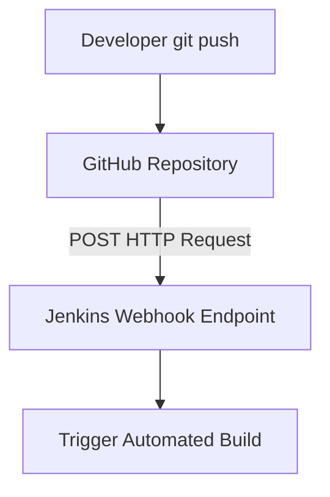

# Module 13: Advanced CI/CD Pipelines with Jenkins

## Core Curriculum
- Multi-Branch Pipelines: Automated tracking of git branches
- Maven Integration in Jenkins (Tool Declarations)
- Docker + Jenkins Integration: Mounting Docker Socket & using Docker Agents
- Triggering Automations: Webhooks and `pollSCM`
- Jenkins Security & Pipeline Best Practices

---

## 1. Multi-Branch Pipelines
In modern development workflows, developers write code on `feature/*` branches and submit Pull Requests to `main`. Running the CI pipeline *only* on the `main` branch means bugs are discovered too late.

A **Multi-Branch Pipeline** solves this:
- It automatically scans your Git repository for any branch containing a `Jenkinsfile`.
- It dynamically provisions separate build histories and schedules runs for each branch individually.
- Once a branch is merged and deleted, Jenkins cleans up the corresponding execution path automatically.

---

## 2. Integrated Build Tools (Maven Setup)
To build Java applications in Jenkins, we must specify where Maven lives. We can either declare a pre-installed Global Tool in Jenkins or use the native Maven Wrapper (`mvnw`).

In Declarative pipelines, we bind tools using the `tools` block. This automatically registers the binary on the runner's path:
```groovy
pipeline {
    agent any
    tools {
        maven 'Maven_3.9.5' // Binds the specific Maven instance declared in Jenkins global settings
        jdk 'JDK_17'        // Binds the specific Java installation
    }
    stages {
        stage('Build') {
            steps {
                sh 'mvn clean package'
            }
        }
    }
}
```

---

## 3. Docker-in-Jenkins Integration
Running builds in a standard VM runner leaves residual artifacts that pollute the workspace. Advanced Jenkins setups use **Docker Containers as Agents**.

For this to work, the Jenkins Master (or Agent VM) must be able to interface with a Docker Daemon. This is typically achieved by mounting the host VM's Docker socket `/var/run/docker.sock` directly inside the Jenkins container:

```bash
docker run -d \
  --name jenkins-docker \
  -p 8080:8080 \
  -v /var/run/docker.sock:/var/run/docker.sock \
  -v jenkins_home:/var/jenkins_home \
  jenkins/jenkins:lts
```

### Running stages INSIDE a Docker container:
You can specify a Docker image directly in the `agent` parameter of a stage or pipeline. Jenkins will automatically boot that container, run the step scripts inside it, and destroy the container once the stage finishes!

```groovy
pipeline {
    agent none // Do not bind a global agent
    stages {
        stage('Compile') {
            agent {
                docker { 
                    image 'maven:3.9.5-eclipse-temurin-17' 
                    reuseNode true
                }
            }
            steps {
                sh 'mvn -version'
                sh 'mvn clean compile'
            }
        }
    }
}
```

---

## 4. Triggering Builds: Webhooks vs. PollSCM
Manually clicking "Build Now" is not CI/CD. Builds should launch immediately upon a developer committing code.



### A. Webhook Triggers (Recommended)
When code is pushed, GitHub sends an HTTP POST request to Jenkins (`http://<jenkins-url>/github-webhook/`). Jenkins immediately triggers the matching pipeline. This is instantaneous and puts zero load on Jenkins.

### B. Polling SCM (`pollSCM`)
If Jenkins resides behind a strict firewall and cannot receive inbound webhooks, it can actively poll GitHub at regular intervals (e.g., every 5 minutes) to see if new commits exist.
```groovy
pipeline {
    agent any
    triggers {
        cron('H H/* * * 1-5') // Cron scheduling
        pollSCM('*/5 * * * *') // Poll Git for changes every 5 minutes
    }
}
```

---

## 5. Pipeline Best Practices
1. **Never Run Builds on Controller:** Always delegate workloads to Agent executors to prevent the web console from locking up.
2. **Handle Secrets Securely:** Never hardcode passwords. Use `withCredentials` to inject environment variables securely from the Jenkins Credentials Provider.
   ```groovy
   withCredentials([usernamePassword(credentialsId: 'docker-hub-creds', passwordVariable: 'PASS', usernameVariable: 'USER')]) {
       sh "docker login -u ${USER} -p ${PASS}"
   }
   ```
3. **Set Timeouts:** Prevent runaway build loops by wrapping execution steps in standard `timeout` limits.
