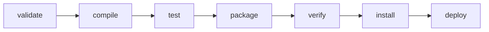

# Module 7: Build Automation with Apache Maven

## Core Curriculum
- The philosophy of build automation and why Apache Maven dominates
- Maven Directory Layout: Standard Directory Layout (SDL)
- Project Object Model (POM) anatomy: `pom.xml` structure
- The Maven Build Lifecycle: Phases from `validate` to `deploy`
- Dependency Management & Scopes: `compile`, `provided`, `runtime`, `test`, `system`, `import`

---

## 1. Why Build Automation?
In professional software engineering, building an application is far more complex than just compilation. It involves:
1. **Compilation:** Converting source code to bytecode.
2. **Resource Management:** Copying configuration files, properties, and static assets to correct target directories.
3. **Dependency Resolution:** Fetching external libraries, transitive dependencies, and ensuring version compatibility.
4. **Testing Execution:** Running unit/integration tests and generating coverage reports.
5. **Packaging:** Bundling bytecode and resources into distributable formats (e.g., `.jar`, `.war`, `.ear`).
6. **Distribution:** Installing the package in local cache or deploying it to a remote binary repository (e.g., Maven Central, Nexus, Artifactory).

**Apache Maven** solves this through **Convention over Configuration**. By defining a standard layout and a predictable lifecycle, developers don't have to write custom build scripts (like in older systems like Ant).

---

## 2. The Maven Directory Layout
To ensure that projects look identical across different teams, Maven mandates the **Standard Directory Layout**:

```text
my-app/
├── pom.xml                           # Project Object Model configuration
└── src/                              # All source files
    ├── main/                         # Production code and assets
    │   ├── java/                     # Java source code (.java files)
    │   └── resources/                # App configurations (application.properties, XMLs, logs)
    └── test/                         # Test suites and testing assets
        ├── java/                     # Unit and integration tests
        └── resources/                # Configurations isolated for testing
```

When you run a Maven build, it compiles files from `src/main/java`, processes files in `src/main/resources`, runs tests in `src/test/java`, and places all compiled outputs and the final packaged archive into a dynamically created `target/` directory.

---

## 3. Demystifying the `pom.xml`
The `pom.xml` (Project Object Model) is the declarative heart of a Maven project. It defines the project's coordinates, properties, dependencies, and build plugins.

Here is a minimal, production-ready `pom.xml` skeleton:

```xml
<?xml version="1.0" encoding="UTF-8"?>
<project xmlns="http://maven.apache.org/POM/4.0.0"
         xmlns:xsi="http://www.w3.org/2001/XMLSchema-instance"
         xsi:schemaLocation="http://maven.apache.org/POM/4.0.0 http://maven.apache.org/xsd/maven-4.0.0.xsd">
    <modelVersion>4.0.0</modelVersion>

    <!-- Maven Coordinates -->
    <groupId>com.lpu.devops</groupId>
    <artifactId>maven-basics</artifactId>
    <version>1.0-SNAPSHOT</version>
    <packaging>jar</packaging>

    <name>Maven Basics Demo</name>
    
    <properties>
        <maven.compiler.source>17</maven.compiler.source>
        <maven.compiler.target>17</maven.compiler.target>
        <project.build.sourceEncoding>UTF-8</project.build.sourceEncoding>
        <junit.version>5.10.1</junit.version>
    </properties>

    <dependencies>
        <!-- Test Dependency (Only available during test execution) -->
        <dependency>
            <groupId>org.junit.jupiter</groupId>
            <artifactId>junit-jupiter-api</artifactId>
            <version>${junit.version}</version>
            <scope>test</scope>
        </dependency>
        <dependency>
            <groupId>org.junit.jupiter</groupId>
            <artifactId>junit-jupiter-engine</artifactId>
            <version>${junit.version}</version>
            <scope>test</scope>
        </dependency>
    </dependencies>
</project>
```

### Key Elements:
- **`groupId`**: The organization or package prefix (e.g., `com.lpu.devops`).
- **`artifactId`**: The unique name of the project library/module.
- **`version`**: The current development phase. `SNAPSHOT` indicates it is actively evolving.
- **`packaging`**: The output type (`jar`, `war`, `pom`).

---

## 4. Maven Build Lifecycle Phases
Maven organizes its execution into three built-in lifecycles: **default**, **clean**, and **site**. 
The default lifecycle handles project deployment and consists of sequential phases. Running a phase automatically executes **every preceding phase** in that lifecycle.



### Core Default Phases:
1. **`validate`**: Confirms that the project is correct and all necessary information is available.
2. **`compile`**: Translates source code (`.java`) in `src/main/java` to Java bytecode (`.class`) in `target/classes`.
3. **`test`**: Compiles test classes and runs unit tests (e.g., JUnit) under `src/test/java`.
4. **`package`**: Packs the compiled code into its distributable format (e.g., `.jar`) inside `target/`.
5. **`verify`**: Runs integration tests to ensure quality criteria are met.
6. **`install`**: Copies the package into your local repository cache (`~/.m2/repository`) so other local projects can use it as a dependency.
7. **`deploy`**: Pushes the package to a remote Maven repository (like Nexus or Maven Central) for consumption by other developers.

---

## 5. Dependency Scopes
Maven manages when a dependency is added to the classpath using the `<scope>` tag. This prevents bloating production bundles with test tools or container runtime containers.

| Scope | Compiling Classpath | Testing Classpath | Runtime Classpath | Packed in Artifact? | Example / Use Case |
|---|---|---|---|---|---|
| **`compile`** *(Default)* | Yes | Yes | Yes | **Yes** | Logback, Apache Commons. Required at all stages. |
| **`provided`** | Yes | Yes | No | **No** | Servlet API, Lombok. Provided by the host container (e.g., Tomcat) or compiler. |
| **`runtime`** | No | Yes | Yes | **Yes** | JDBC Driver implementations (e.g., MySQL Connector). |
| **`test`** | No | Yes | No | **No** | JUnit, Mockito, AssertJ. Only needed to compile and run tests. |
| **`system`** | Yes | Yes | No | **No** | Local `.jar` on disk. Requires an absolute path (Avoid in production!). |
| **`import`** | N/A | N/A | N/A | **No** | Used to import dependency management configurations from other POMs. |

---

## Summary
Maven transforms software compilation from an ad-hoc set of shell scripts to a robust, standardized lifecycle based on **convention over configuration**. By declarative specification of dependencies, scopes, and properties inside the `pom.xml`, Maven handles resource processing, compilation, dependency injection, and packaging in a clean, consistent manner.
