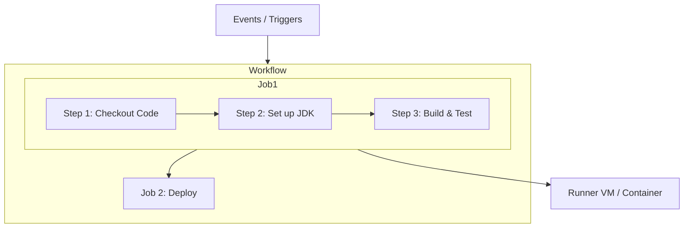

# Module 9: Continuous Integration with GitHub Actions

## Core Curriculum
- Understanding Continuous Integration (CI)
- GitHub Actions Architecture: Workflows, Triggers, Jobs, Steps, Actions, and Runners
- Workflow Directory Structure: `.github/workflows/`
- Declaring Event Triggers: `push`, `pull_request`, `schedule`, `workflow_dispatch`
- Environment Variables and Basic Contexts

---

## 1. What is Continuous Integration?
Continuous Integration (CI) is the practice of automating the integration of code changes from multiple contributors into a single software project. 

### Key Pillars of CI:
1. **Automated Testing:** Every push or pull request automatically launches compiler steps and testing suites to verify no functionality is broken.
2. **Immediate Feedback:** Developers receive real-time notifications about compilation or test failures.
3. **Reproducible Environment:** Builds are run inside clean, isolated containers or VMs rather than "working on a developer's local machine".

---

## 2. GitHub Actions Architecture
GitHub Actions is a Native CI/CD orchestrator built directly into GitHub. Its architecture is built around several core components:



- **Workflow:** An automated process defined in a YAML file inside `.github/workflows/`.
- **Event / Trigger:** A specific activity that triggers a workflow (e.g., a push, a PR, or a scheduled cron).
- **Job:** A set of steps executed sequentially on the **same runner**. Jobs run in parallel by default but can have dependencies configured (e.g., Job B runs only if Job A succeeds).
- **Step:** An individual task that runs commands or actions.
- **Action:** A standalone reusable application (e.g., `actions/checkout@v4`) that performs complex tasks.
- **Runner:** The virtual machine (Ubuntu, Windows, or macOS) or container that hosts the job.

---

## 3. Directory Layout
For GitHub to discover and run workflows, they **must** be stored in a specific hidden folder structure at the root of the Git repository:

```text
my-project/
├── .github/
│   └── workflows/
│       ├── ci-pipeline.yml
│       └── nightly-cleanup.yml
└── src/
```

---

## 4. Basic Declarative YAML Syntax
Here is a complete, minimal, and fully functioning CI workflow:

```yaml
# Name of the Workflow
name: Java CI with Maven

# Event Triggers
on:
  push:
    branches: [ main, dev ]
  pull_request:
    branches: [ main ]
  workflow_dispatch: # Enables manual run trigger button in GitHub UI

# Global Environment Variables
env:
  PROJECT_VERSION: 1.0.0
  TARGET_ENV: staging

# Jobs to execute
jobs:
  build-and-test:
    # Runner environment
    runs-on: ubuntu-latest

    steps:
      # Step 1: Checkout the source repository code
      - name: Checkout Code
        uses: actions/checkout@v4

      # Step 2: Set up the correct JDK version
      - name: Set up JDK 17
        uses: actions/setup-java@v3
        with:
          java-version: '17'
          distribution: 'temurin'
          cache: 'maven'

      # Step 3: Run compilation and unit test suite
      - name: Build with Maven
        run: mvn -B clean package --file pom.xml
```

---

## 5. Event Triggers Deep Dive
You can trigger workflows in diverse ways:

### A. Code Event Triggers (Filters)
Scope triggers to specific branches, paths, or tags to prevent unnecessary runner minutes.
```yaml
on:
  push:
    branches:
      - main
      - 'feature/*'
    paths:
      - 'src/**'
      - 'pom.xml'
```

### B. Scheduled Triggers (Cron Syntax)
Run automated tasks at scheduled intervals.
```yaml
on:
  schedule:
    - cron: '0 0 * * *' # Runs every day at midnight UTC
```

### C. Manual Triggers (`workflow_dispatch`)
Allows engineers to trigger workflows manually from the GitHub UI, optionally accepting input parameters.
```yaml
on:
  workflow_dispatch:
    inputs:
      debug_mode:
        description: 'Enable Verbose Debug Logs'
        required: true
        default: 'false'
        type: boolean
```

---

## Summary
GitHub Actions native integration eliminates complex external server configurations for CI/CD. Workflows are declared inside `.github/workflows/` using standard YAML schemas and can trigger on code pushes, PR requests, crons, or manual operations, executing steps in isolated, clean Virtual Machine Runners.
